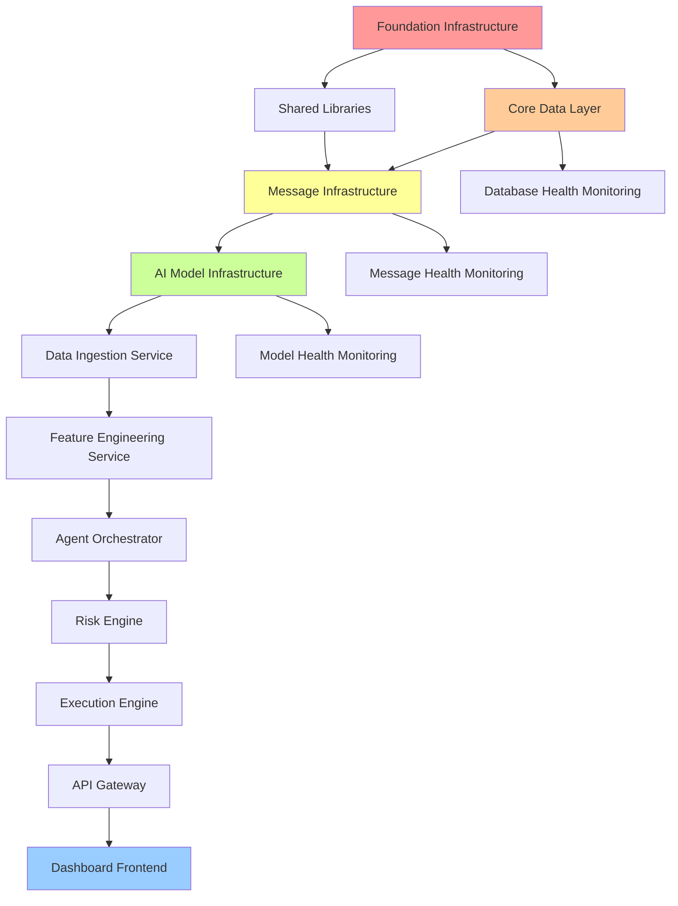

# Inter-Service Dependencies & Critical Path

**Last Updated**: August 25, 2025  
**Purpose**: Track dependencies between components to ensure proper build order  
**Critical Path**: Foundation ✅ → Data ✅ → Messaging ✅ → AI ✅ → Services ✅ → PhD Intelligence ✅ → **Dashboard (Current)**  

---

## 🔗 Service Dependency Graph



---

## 🎯 Current Phase 8 Status

### Phase 8: Dashboard and API (IN PROGRESS)
**Dependencies**: ✅ Phase 7 Complete - PhD-Level Intelligence & Testing  
**Current Status**: 10% Complete (Dashboard Frontend Started)  
**Provides For**: Phase 9 Integration Testing  
**Critical Components**:
- React/Next.js dashboard foundation (🟡 In Progress)
- Real-time data visualization components
- API Gateway with authentication
- Intelligence visualization interfaces
- Company intelligence profile displays

**Blocks If Missing**: Cannot proceed to Phase 9 integration testing

---

## 🏗️ Phase Dependencies

### Phase 1: Foundation Infrastructure
**Dependencies**: None (Start here)  
**Provides For**: All subsequent phases  
**Critical Components**:
- Docker infrastructure
- Monitoring stack (Prometheus/Grafana)
- Reverse proxy (Traefik)
- Basic networking

**Blocks If Missing**: Everything - No subsequent work possible

### Phase 2: Core Data Layer  
**Dependencies**: Phase 1 Complete  
**Provides For**: Phases 3, 5, 6, 7, 8  
**Critical Components**:
- Redis (hot data storage)
- QuestDB (time-series data)
- Weaviate (vector storage) 
- ArangoDB (graph data)
- Data access patterns

**Blocks If Missing**: Data ingestion, feature engineering, agent memory, dashboard

### Phase 3: Message Infrastructure
**Dependencies**: Phase 1, 2 Complete  
**Provides For**: Phases 5, 6, 7, 8  
**Critical Components**:
- Apache Pulsar broker
- Message schemas
- Pub/sub patterns
- Message validation

**Blocks If Missing**: All inter-service communication, real-time features

### Phase 4: AI Model Infrastructure
**Dependencies**: Phase 1 Complete  
**Provides For**: Phases 5, 7, 8  
**Critical Components**:
- Local LLM serving (Ollama)
- Model management
- API integration (OpenAI, Anthropic)
- Model monitoring

**Blocks If Missing**: Agent decision-making, natural language processing

### Phase 5: Core Python Services
**Dependencies**: Phases 1, 2, 3, 4 Complete  
**Provides For**: Phases 6, 7, 8  
**Critical Components**:
- Data ingestion service
- Feature engineering service
- Agent orchestrator base

**Blocks If Missing**: Real-time data processing, trading signals

### Phase 6: Core Rust Services
**Dependencies**: Phases 1, 2, 3, 5 Complete  
**Provides For**: Phases 7, 8  
**Critical Components**:
- Risk engine
- Execution engine
- Performance-critical paths

**Blocks If Missing**: Trade execution, risk management

### Phase 7: Agent Swarm Implementation
**Dependencies**: Phases 1, 2, 3, 4, 5, 6 Complete  
**Provides For**: Phase 8  
**Critical Components**:
- Individual AI agents
- Consensus engine
- Agent coordination

**Blocks If Missing**: Intelligent trading decisions

### Phase 8: Dashboard and API
**Dependencies**: All previous phases complete  
**Provides For**: End users  
**Critical Components**:
- API Gateway
- Frontend dashboard
- Real-time WebSocket features

**Blocks If Missing**: User interface, system monitoring

---

## 🎯 Critical Dependencies by Service

### Infrastructure Services (Phase 1)
```yaml
traefik:
  depends_on: []
  provides_for: [all_services]
  ports: [8080, 8443]
  health_check: "http://localhost:8080/api/overview"

redis:
  depends_on: []
  provides_for: [feature_cache, session_storage, real_time_data]
  ports: [6379]
  health_check: "redis-cli ping"

questdb:
  depends_on: []
  provides_for: [time_series_data, historical_analysis]
  ports: [9000, 8812]
  health_check: "curl -s http://localhost:9000/exec?query=SELECT%201"

prometheus:
  depends_on: [traefik, redis, questdb]
  provides_for: [monitoring, alerting]
  ports: [9090]
  health_check: "curl -s http://localhost:9090/api/v1/targets"

grafana:
  depends_on: [prometheus]
  provides_for: [monitoring_dashboards]
  ports: [3001]
  health_check: "curl -s http://localhost:3001/api/health"
```

### Data Layer Services (Phase 2)
```yaml
weaviate:
  depends_on: [traefik]
  provides_for: [vector_search, rag_system]
  ports: [8080]
  health_check: "curl -s http://localhost:8080/v1/schema"

arangodb:
  depends_on: [traefik]
  provides_for: [graph_relationships, knowledge_graph]
  ports: [8529]
  health_check: "curl -s http://localhost:8529/_api/version"

minio:
  depends_on: [traefik]
  provides_for: [object_storage, model_artifacts]
  ports: [9001, 9002]
  health_check: "curl -s http://localhost:9001/minio/health/live"
```

### Message Infrastructure (Phase 3)
```yaml
pulsar:
  depends_on: [traefik]
  provides_for: [all_microservices_communication]
  ports: [6650, 8082]
  health_check: "curl -s http://localhost:8082/admin/v2/brokers/health"
  topics:
    - market.raw
    - news.processed
    - features.technical
    - signals.generated
    - risk.assessments
    - orders.pending
    - fills.confirmed
```

### AI Model Services (Phase 4)
```yaml
model_server:
  depends_on: [traefik, minio]
  provides_for: [agent_inference, nlp_processing]
  ports: [8003]
  health_check: "curl -s http://localhost:8003/health"
  models:
    - llama-3.1-8b
    - qwen2.5-7b
    - finbert
```

### Core Services (Phases 5-6)
```yaml
data_ingestion:
  depends_on: [redis, questdb, pulsar]
  provides_for: [feature_engineering, market_data]
  ports: [8004]
  health_check: "curl -s http://localhost:8004/health"

feature_engine:
  depends_on: [data_ingestion, redis, questdb]
  provides_for: [agent_orchestrator, risk_engine]
  ports: [8005]
  health_check: "curl -s http://localhost:8005/health"

risk_engine:
  depends_on: [feature_engine, redis, pulsar]
  provides_for: [execution_engine, agent_orchestrator]
  ports: [8006]
  health_check: "curl -s http://localhost:8006/health"

execution_engine:
  depends_on: [risk_engine, pulsar]
  provides_for: [trading_execution]
  ports: [8007]
  health_check: "curl -s http://localhost:8007/health"
```

---

## ⚡ Critical Path Analysis

### Primary Critical Path (Must be completed sequentially)
1. **Foundation Infrastructure** → 2. **Core Data Layer** → 3. **Message Infrastructure** → 5. **Data Ingestion** → 6. **Feature Engineering** → 6. **Risk Engine** → 6. **Execution Engine** → 8. **Dashboard**

### Parallel Development Opportunities
- **Phase 4 (AI Models)** can be developed in parallel with **Phase 3 (Messaging)**
- **Shared Libraries** can be enhanced during any phase
- **Documentation** can be written in parallel with development
- **Testing frameworks** can be developed alongside each component

### Bottleneck Analysis
1. **Phase 2 (Data Layer)**: Blocks the most subsequent work
2. **Phase 3 (Messaging)**: Required for all inter-service communication  
3. **Phase 6 (Rust Services)**: Required for actual trading functionality

---

## 🚀 Service Start Order

### Development Environment Startup
```bash
# 1. Infrastructure Services (Required First)
docker-compose up -d traefik redis questdb prometheus grafana

# 2. Extended Data Services
docker-compose up -d weaviate arangodb minio

# 3. Message Broker  
docker-compose up -d pulsar

# 4. AI Model Server
docker-compose up -d model-server

# 5. Core Python Services
docker-compose up -d data-ingestion feature-engine agent-orchestrator

# 6. Core Rust Services  
docker-compose up -d risk-engine execution-engine

# 7. API and Frontend
docker-compose up -d api-gateway dashboard
```

### Production Startup Order
```bash
# Same order as development, but with health checks between each step
make start-infrastructure && make wait-for-health
make start-data-services && make wait-for-health  
make start-messaging && make wait-for-health
make start-ai-services && make wait-for-health
make start-core-services && make wait-for-health
make start-trading-services && make wait-for-health
make start-user-services && make wait-for-health
```

---

## 🩺 Health Check Dependencies

### Service Health Validation
```yaml
health_check_order:
  level_1: [traefik, redis, questdb]
  level_2: [prometheus, grafana, weaviate, arangodb, minio]  
  level_3: [pulsar]
  level_4: [model-server]
  level_5: [data-ingestion, feature-engine]
  level_6: [risk-engine, execution-engine, agent-orchestrator]
  level_7: [api-gateway, dashboard]
```

### Health Check Commands
```bash
# Check Level 1 (Foundation)
curl -f http://localhost:8080/api/overview
redis-cli ping
curl -f "http://localhost:9000/exec?query=SELECT%201"

# Check Level 2 (Extended Infrastructure)  
curl -f http://localhost:9090/api/v1/targets
curl -f http://localhost:3001/api/health
curl -f http://localhost:8080/v1/schema  # Weaviate
curl -f http://localhost:8529/_api/version  # ArangoDB

# Check Level 3 (Messaging)
curl -f http://localhost:8082/admin/v2/brokers/health

# Check Level 4+ (Application Services)
# Health checks defined per service as they're developed
```

---

## 🚨 Dependency Violation Alerts

### What NOT to Do
❌ **Never start Phase N+1 before Phase N is 100% complete**  
❌ **Never skip health checks when starting dependent services**  
❌ **Never modify shared schemas without updating all dependents**  
❌ **Never deploy services without their dependencies running**  

### Emergency Dependency Recovery
```bash
# If dependency chain breaks:
1. Stop all services: make stop-all
2. Check infrastructure: make check-infrastructure  
3. Restart in dependency order: make start-in-order
4. Validate each level: make health-check-all
5. Resume development: make resume-development
```

---

## 📊 Dependency Metrics

### Service Coupling Analysis
- **Highly Coupled**: Risk Engine ↔ Execution Engine
- **Moderately Coupled**: Data Ingestion ↔ Feature Engine
- **Loosely Coupled**: Dashboard ↔ Core Services (via API)

### Failure Impact Analysis
- **Redis Failure**: Affects real-time features, session storage
- **QuestDB Failure**: Affects historical analysis, reporting
- **Pulsar Failure**: Affects all inter-service communication  
- **Model Server Failure**: Affects intelligent decision-making

### Recovery Time Objectives
- **Infrastructure Services**: <30 seconds recovery
- **Data Services**: <60 seconds recovery
- **Application Services**: <120 seconds recovery
- **Full System**: <5 minutes recovery

---

**🔄 This file tracks all critical dependencies for proper build sequencing.**  
**Update when**: Adding new services, changing dependencies, or modifying startup order